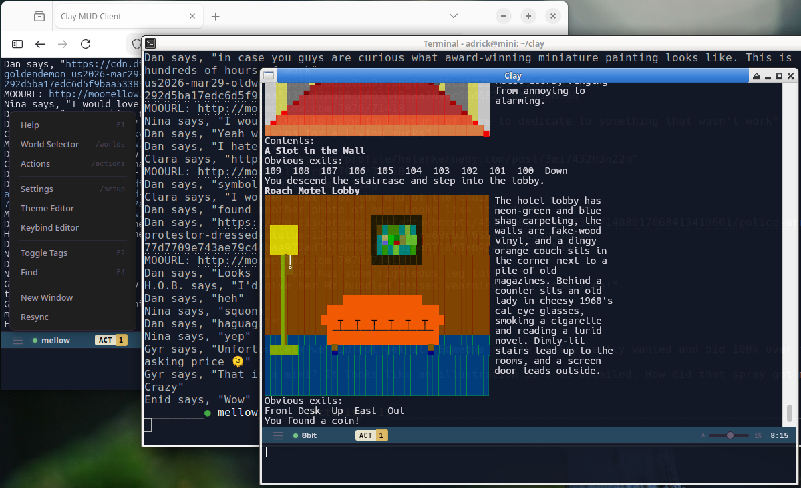

# Clay MUD Client

A terminal-based MUD (Multi-User Dungeon) client built with Rust featuring multi-world support, ANSI color rendering, and a web interface.


*A single Clay instance viewed simultaneously from a remote terminal, a Firefox web client, and a native egui GUI — with the browser-based theme editor open for live color customization.*

## Features

- **Multi-World Support** - Connect to multiple MUD servers simultaneously
- **SSL/TLS** - Secure connections with full TLS support
- **ANSI Colors** - Full ANSI color and formatting support (256-color, true color)
- **Web Interface** - Browser-based client via WebSocket
- **Remote GUI** - Optional graphical client using egui
- **Remote Console** - Connect to a running Clay instance from another terminal
- **More-Mode** - Pagination for fast-scrolling output
- **Scrollback** - Unlimited history with PageUp/PageDown navigation
- **Command History** - Navigate previous commands with Ctrl+P/N
- **Telnet Protocol** - Full telnet negotiation with keepalive support (SGA, TTYPE, EOR, NAWS)
- **Auto-Login** - Configurable automatic login (Connect, Prompt, MOO modes)
- **Hot Reload** - Update the binary without losing connections (`/reload`)
- **Self-Update** - Download and install latest release from GitHub (`/update`)
- **TLS Proxy** - Optional proxy to preserve TLS connections across hot reload
- **Spell Check** - Built-in spell checking with suggestions
- **Output Filtering** - Search/filter output with F4
- **File Logging** - Per-world output logging
- **ANSI Music** - BBS-style music playback (web/GUI interfaces)
- **GMCP Media** - Server-driven sound effects and music via Client.Media protocol
- **Actions/Triggers** - Pattern matching with regex or wildcard, auto-commands
- **TinyFugue Compatibility** - Full TF command support (`/def`, `/set`, `/if`, `/load`, etc.)
- **Themes** - Customizable color themes for GUI/web via `~/clay.theme.dat` with browser-based theme editor
- **Notes Editor** - Per-world split-screen notes editor (`/edit`)
- **Termux Support** - Runs on Android via Termux
- **Android App** - WebSocket client with push notifications via `/notify`
- **Daemon Mode** - Run headless as a background process

## Installation

### Pre-built Binaries

Download pre-built binaries from the [Releases](https://github.com/c-hudson/clay/releases) page:

| Platform | Binary | Notes |
|----------|--------|-------|
| Linux x86_64 (static) | `clay-linux-x86_64-musl` | TUI only, works on any Linux |
| Linux ARM64 (Termux) | `clay-termux-aarch64` | TUI only, for Android/Termux |
| Android | `clay-android.apk` | WebSocket client app |
| macOS (Universal) | `clay-macos-universal` | GUI + audio, Intel & Apple Silicon |
| Windows x86_64 | `clay-windows-x86_64.exe` | GUI + audio |

```bash
# Example: Download and install on Linux
curl -L https://github.com/c-hudson/clay/releases/latest/download/clay-linux-x86_64-musl -o clay
chmod +x clay
./clay
```

## Building from Source

### Linux

```bash
# Install dependencies (Debian/Ubuntu)
sudo apt install libasound2-dev libxcb-render0-dev libxcb-shape0-dev libxcb-xfixes0-dev libxcb1-dev pkg-config

# Build with GUI + audio
cargo build --release --features remote-gui-audio

# Static binary for any Linux (TUI only, no GUI)
rustup target add x86_64-unknown-linux-musl
cargo build --release --target x86_64-unknown-linux-musl --no-default-features --features rustls-backend
```

### macOS

```bash
# Install Rust
curl --proto '=https' --tlsv1.2 -sSf https://sh.rustup.rs | sh

# Build with GUI + audio
cargo build --release --features remote-gui-audio
```

### Windows

```bash
# Install Rust from https://rustup.rs

# Build with GUI + audio
cargo build --release --features remote-gui-audio
```

### Termux (Android)

```bash
# Install Rust in Termux
pkg install rust

# Build TUI only (no GUI on Android)
cargo build --release --no-default-features --features rustls-backend
```

## Usage

```bash
# Run the TUI client
./clay

# Run as remote GUI client (connects to running Clay instance)
./clay --remote=hostname:port

# Run as remote console client
./clay --console=hostname:port
```

## Commands

| Command | Description |
|---------|-------------|
| `/worlds` | Open world selector popup |
| `/worlds <name>` | Connect to or create a world |
| `/worlds -e [name]` | Edit world settings |
| `/connections` or `/l` | List connected worlds |
| `/disconnect` or `/dc` | Disconnect current world |
| `/send [-w world] text` | Send text to a world |
| `/setup` | Open global settings |
| `/web` | Open web/WebSocket settings |
| `/actions` | Open actions/triggers editor |
| `/edit` | Open split-screen notes editor |
| `/menu` | Open menu popup |
| `/reload` | Hot reload the binary |
| `/update` | Download and install latest release |
| `/notify <msg>` | Send notification to Android app |
| `/testmusic` | Play test ANSI music sequence |
| `/quit` | Exit the client |
| `/help` | Show help |

## TinyFugue Commands

Clay includes a TinyFugue compatibility layer. All TF commands work with both `/` and `#` prefixes:

| Command | Description |
|---------|-------------|
| `/set name value` | Set a variable |
| `/echo message` | Display local message |
| `/def name = body` | Define a macro/trigger |
| `/if (expr) cmd` | Conditional execution |
| `/while (expr) ... /done` | While loop |
| `/for var start end ... /done` | For loop |
| `/bind key = cmd` | Bind key to command |
| `/load filename` | Load a TF script file |
| `/tfhelp [topic]` | Show TF help |

The `#` prefix also works for backward compatibility. See `/tfhelp` for full command list.

### Importing TinyFugue Worlds

If you have an existing TinyFugue configuration, you can import your worlds using `/load`:

```bash
/load ~/.tfrc
```

Clay will parse `/addworld` commands from your TF config file and create corresponding worlds. This makes migrating from TinyFugue seamless - your existing world definitions are automatically imported.

## Controls

| Key | Action |
|-----|--------|
| `Up/Down` | Switch between active worlds |
| `PageUp/PageDown` | Scroll output history |
| `Tab` | Release one screenful (when paused) |
| `Escape j` | Jump to end, release all pending |
| `Escape w` | Switch to world with activity |
| `Ctrl+P/N` | Command history |
| `Ctrl+U` | Clear input |
| `Ctrl+W` | Delete word |
| `Ctrl+Q` | Spell suggestions |
| `Ctrl+L` | Redraw screen |
| `Ctrl+R` | Hot reload |
| `F1` | Help |
| `F2` | Toggle MUD tag display |
| `F4` | Filter output |
| `F8` | Toggle action highlighting |
| `F9` | Toggle GMCP media audio |
| `Ctrl+C` (x2) | Quit |

**Mouse (enabled by default via "Console Mouse" in `/setup`):**
- Click popup buttons and fields to interact
- Click list items to select them
- Click and drag to highlight lines in scrollable content

## Android App

The Android app (`clay-android.apk`) is a WebSocket client that connects to a running Clay instance:

1. Run Clay on a server/computer with WebSocket enabled (`/web` settings)
2. Install the APK on your Android device
3. Enter the server address and WebSocket password
4. Connect to control your MUD sessions remotely

Features:
- Full MUD client interface
- Push notifications via `/notify` command
- Background service keeps connection alive
- Works alongside Termux native binary

## Web Interface

Enable in `/web` settings:

1. Set `HTTP enabled` to Yes (default port: 9000)
2. Set `WS enabled` to Yes for secure WebSocket (default port: 9002)
3. Set a `WS password` (required for authentication)
4. Optionally configure TLS cert/key for HTTPS

Access via browser at `http://localhost:9000`.

## Actions/Triggers

Actions match incoming MUD output against patterns and execute commands:

1. Open `/actions` to create triggers
2. Set a pattern (regex or wildcard)
3. Set command(s) to execute when matched
4. Use `$1`-`$9` for captured groups, `$0` for full match

Example: Pattern `* tells you: *` with command `/echo Got tell from $1`

## Themes

Clay supports customizable color themes for the GUI and web interfaces:

- Theme file: `~/clay.theme.dat` (INI format with `[theme:name]` sections)
- Browser-based theme editor included for live color preview
- Select themes in `/setup` (GUI Theme setting)
- Console uses separate dark/light theme toggle

## Configuration

Settings are stored in `~/.clay.dat`. Per-world settings include:

- Hostname, port, SSL toggle
- Username/password for auto-login
- Character encoding (UTF-8, Latin1, FANSI)
- Auto-login type (Connect, Prompt, MOO_prompt)
- Keepalive type (NOP, Custom, Generic)
- Log file path

## License

MIT
