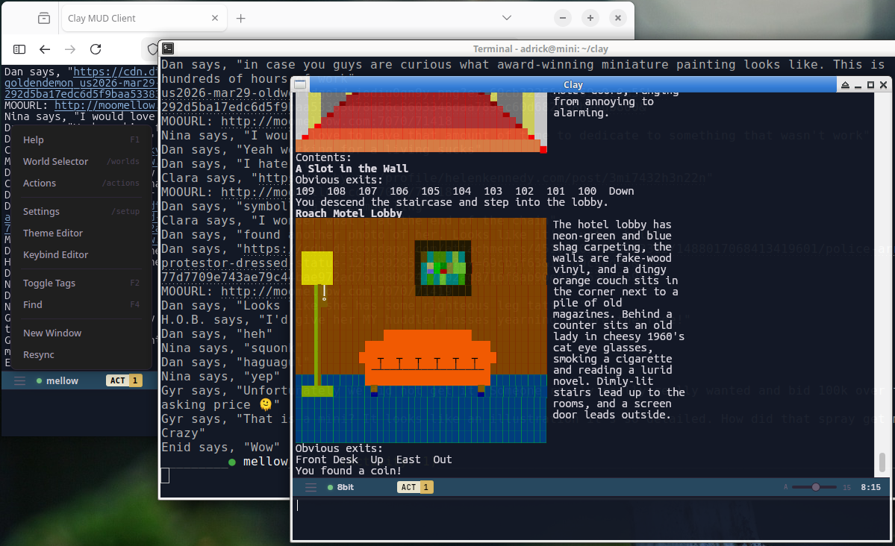

# Clay MUD Client

A terminal-based MUD (Multi-User Dungeon) client built with Rust featuring multi-world support, ANSI color rendering, spell checking, tinyfugue compatibility and remote viewing with a web interface and android app.


*A single Clay instance viewed simultaneously from a remote terminal, a Firefox web client, and a native WebView GUI.*

## Features

- **Multi-World Support** - Connect to multiple MUD servers simultaneously
- **SSL/TLS** - Secure connections with full TLS support
- **ANSI Colors** - Full ANSI color and formatting support (256-color, true color)
- **Web Interface** - Browser-based client via WebSocket
- **WebView GUI** - Native graphical client using system WebView (wry/tao)
- **Remote Console** - Connect to a running Clay instance from another terminal
- **More-Mode** - Pagination for fast-scrolling output
- **Scrollback** - Unlimited history with PageUp/PageDown navigation
- **Command History** - Navigate previous commands with Ctrl+P/N
- **Telnet Protocol** - Full telnet negotiation with keepalive support (SGA, TTYPE, EOR, NAWS, MCCP2, GMCP, MSDP)
- **Auto-Login** - Configurable automatic login (Connect, Prompt, MOO modes)
- **Hot Reload** - Update the binary without losing connections (`/reload`)
- **Crash Recovery** - Automatic restart with state preservation on panic
- **Self-Update** - Download and install latest release from GitHub (`/update`)
- **TLS Proxy** - Optional proxy to preserve TLS connections across hot reload
- **Spell Check** - Built-in spell checking with suggestions
- **Command Completion** - Tab completion for `/` commands and action names
- **Output Filtering** - Search/filter output with F4
- **File Logging** - Per-world output logging
- **ANSI Music** - BBS-style music playback (web/GUI interfaces)
- **GMCP** - Generic MUD Communication Protocol for structured data exchange
- **MSDP** - MUD Server Data Protocol for server variable updates
- **GMCP Media** - Server-driven sound effects and music via Client.Media protocol
- **MCCP2 Compression** - Automatic zlib compression for reduced bandwidth (telnet option 86)
- **Lookup Commands** - Dictionary, Urban Dictionary, translation, and URL shortening (`/dict`, `/urban`, `/translate`, `/url`)
- **Actions/Triggers** - Pattern matching with regex or wildcard, auto-commands, startup actions
- **TinyFugue Compatibility** - Full TF command support (`/def`, `/set`, `/if`, `/load`, etc.)
- **Configurable Keybindings** - All keys configurable via `~/.clay.key.dat` with TF defaults, browser-based editor
- **Kill Ring** - Emacs-style kill ring (Ctrl+K/U/W push, Ctrl+Y yanks)
- **Themes** - Customizable color themes for GUI/web via `~/clay.theme.dat` with browser-based theme editor
- **Context Help** - Press `?` in any popup for beginner-friendly help
- **Notes Editor** - Per-world split-screen notes editor (`/edit`)
- **Termux Support** - Runs on Android via Termux
- **Android App** - WebSocket client with push notifications via `/notify`
- **Grep Mode** - Search world output history or follow live output (`--grep`, `/window --grep`)
- **Daemon Mode** - Run headless as a background process (`-D`)
- **Multiuser Mode** - Shared server with per-user worlds and actions (`--multiuser`)

## Installation

### Pre-built Binaries

Download pre-built binaries from the [Releases](https://github.com/c-hudson/clay/releases) page:

| Platform | Binary | Notes |
|----------|--------|-------|
| Linux x86_64 (static) | `clay-linux-x86_64-musl` | TUI only, works on any Linux |
| Linux x86_64 (GUI) | `clay-linux-x86_64-gui` | TUI + WebView GUI + audio |
| Linux ARM64 (Termux) | `clay-termux-aarch64` | TUI only, for Android/Termux |
| Android | `clay-android.apk` | WebSocket client app |
| macOS (Universal) | `clay-macos-universal` | GUI + audio, Intel & Apple Silicon |
| Windows x86_64 | `clay-windows-x86_64.exe` | GUI + audio |

```bash
# Example: Download and install on Linux
curl -L https://github.com/c-hudson/clay/releases/latest/download/clay-linux-x86_64-musl -o clay
chmod +x clay
./clay
```

## Building from Source

### Linux

```bash
# Static binary for any Linux (TUI only, no GUI)
rustup target add x86_64-unknown-linux-musl
cargo build --release --target x86_64-unknown-linux-musl --no-default-features --features rustls-backend

# Build with WebView GUI + audio (requires GTK/WebKit dev libraries)
sudo apt install libwebkit2gtk-4.1-dev libgtk-3-dev libasound2-dev
cargo build --release --features webview-gui
```

### macOS

```bash
# Install Rust
curl --proto '=https' --tlsv1.2 -sSf https://sh.rustup.rs | sh

# Build with WebView GUI + audio
cargo build --release --features webview-gui
```

### Windows

```bash
# Install Rust from https://rustup.rs
# Install Visual Studio Build Tools (MSVC)

# Build with WebView GUI + audio (uses WebView2)
# Static CRT linking eliminates vcruntime140.dll dependency
set RUSTFLAGS=-C target-feature=+crt-static
cargo build --release --features webview-gui
```

### Termux (Android)

```bash
# Install Rust in Termux
pkg install rust

# Build TUI only (no GUI on Android)
cargo build --release --no-default-features --features rustls-backend
```

## Usage

```bash
# Run the TUI client
./clay

# Run as WebView GUI client (connects to running Clay instance)
./clay --gui=hostname:port

# Run as remote console client
./clay --console=hostname:port

# Run as headless daemon server
./clay -D

# Run as multiuser server
./clay --multiuser

# Search world output history (glob pattern)
CLAY_PASSWORD=pass ./clay --grep=hostname:port '*tells you*'

# Follow live output matching a pattern (like tail -f | grep)
CLAY_PASSWORD=pass ./clay --grep=hostname:port -f '*combat*'

# Use custom config file (default: ~/.clay.dat)
./clay --conf=/path/to/config.dat
```

## Commands

**General:**

| Command | Description |
|---------|-------------|
| `/help [topic]` | Show help (or topic-specific help) |
| `/version` | Show version info |
| `/quit` | Exit the client |
| `/reload` | Hot reload the binary |
| `/update [-f]` | Download and install latest release |
| `/menu` | Open menu popup |

**Worlds & Connections:**

| Command | Description |
|---------|-------------|
| `/worlds` | Open world selector popup |
| `/worlds <name>` | Connect to or switch to a world |
| `/worlds -e [name]` | Edit world settings |
| `/addworld <name> [host port]` | Add/update a world (TF-compatible) |
| `/connections` or `/l` | List connected worlds |
| `/connect [host port [ssl]]` | Connect to a server |
| `/disconnect` or `/dc` | Disconnect current world |
| `/send [-w world] text` | Send text to a world |
| `/flush` | Clear output buffer for current world |
| `/window [world]` | Open new GUI/browser window |
| `/window --grep <pat> [-w world]` | Open grep results window (searchs scrollback + live) |

**Settings & UI:**

| Command | Description |
|---------|-------------|
| `/setup` | Open global settings |
| `/web` | Open web/WebSocket settings |
| `/actions [world]` | Open actions/triggers editor |
| `/edit [file]` | Open split-screen notes editor |
| `/edit -l` | Open notes list popup |
| `/font` | Font settings popup (web/GUI only) |
| `/tag` | Toggle MUD tag display with timestamps (same as F2) |

**Lookup & Utility:**

| Command | Description |
|---------|-------------|
| `/dict <word>` | Look up word definition (Free Dictionary API) |
| `/urban <word>` | Look up word definition (Urban Dictionary) |
| `/translate <lang> <text>` | Translate text (also `/tr`) |
| `/url <url>` | Shorten a URL (is.gd) |

Lookup commands place the result in the input buffer with the cursor at the start, so you can type a prefix (e.g. `say`) before sending.

**Remote & Admin:**

| Command | Description |
|---------|-------------|
| `/remote` | List remotely connected clients |
| `/remote --kill <id>` | Disconnect a remote client |
| `/ban` | Show banned hosts |
| `/unban <host>` | Remove a ban |
| `/notify <msg>` | Send notification to Android app |

**Debug:**

| Command | Description |
|---------|-------------|
| `/testmusic` | Play test ANSI music sequence |
| `/dump` | Dump scrollback buffers to `~/.clay.dmp.log` |

## TinyFugue Commands

Clay includes a TinyFugue compatibility layer. All TF commands work with both `/` and `#` prefixes:

| Command | Description |
|---------|-------------|
| `/set name value` | Set a variable |
| `/echo message` | Display local message |
| `/def name = body` | Define a macro/trigger |
| `/if (expr) cmd` | Conditional execution |
| `/while (expr) ... /done` | While loop |
| `/for var start end ... /done` | For loop |
| `/bind key = cmd` | Bind key to command |
| `/load filename` | Load a TF script file |
| `/tfhelp [topic]` | Show TF help |

The `#` prefix also works for backward compatibility. See `/tfhelp` for full command list.

### Importing TinyFugue Worlds

If you have an existing TinyFugue configuration, you can import your worlds using `/load`:

```bash
/load ~/.tfrc
```

Clay will parse `/addworld` commands from your TF config file and create corresponding worlds. This makes migrating from TinyFugue seamless - your existing world definitions are automatically imported.

## Controls

All keybindings are configurable via `~/.clay.key.dat`. Defaults follow TinyFugue conventions. A browser-based keybind editor is available at `/keybind-editor`.

**World Switching:**

| Key | Action |
|-----|--------|
| `Ctrl+Up/Down` | Switch between active worlds |
| `Shift+Up/Down` | Cycle through all worlds |
| `Escape w` | Switch to world with activity |

**Input Editing:**

| Key | Action |
|-----|--------|
| `Left/Right` | Move cursor one character |
| `Ctrl+B/F` | Move cursor left/right one character |
| `Escape b/f` | Move cursor one word left/right |
| `Up/Down` | Move cursor up/down (multi-line input) |
| `Ctrl+A` / `Home` | Jump to start of line |
| `Ctrl+E` / `End` | Jump to end of line |
| `Ctrl+U` | Clear line |
| `Ctrl+W` | Delete word backward |
| `Ctrl+K` | Kill to end of line |
| `Ctrl+D` | Delete character forward |
| `Ctrl+Y` | Yank (paste from kill ring) |
| `Ctrl+T` | Transpose two characters before cursor |
| `Ctrl+V` | Insert next character literally (console only) |
| `Ctrl+P/N` | Previous/next command history |
| `Ctrl+Q` | Spell suggestions |
| `Ctrl+G` | Terminal bell |
| `Tab` | Command completion (when input starts with `/`) |
| `Escape Space` | Collapse multiple spaces to one |
| `Escape -` | Jump to matching bracket `()[]{}` |
| `Escape .` / `_` | Insert last word from previous history |
| `Escape p` | Search history backward by prefix |
| `Escape n` | Search history forward by prefix |
| `Escape Backspace` | Delete word backward (punctuation-delimited) |
| `Escape c/l/u` | Capitalize / lowercase / uppercase word |
| `Escape d` | Delete word forward |
| `Alt+Up/Down` | Resize input area (1-15 lines) |

**Kill Ring:** `Ctrl+K`, `Ctrl+U`, `Ctrl+W`, `Escape d`, and `Escape Backspace` push deleted text to the kill ring. `Ctrl+Y` pastes the most recent entry.

**Output & Scrollback:**

| Key | Action |
|-----|--------|
| `PageUp/PageDown` | Scroll output history |
| `Tab` | Release one screenful (when paused) |
| `Escape j` | Jump to end, release all pending |
| `Escape J` | Selective flush: keep highlighted pending, discard rest |
| `Escape h` | Half-page scroll up or release half screenful |
| `Ctrl+L` | Redraw screen (keep only server data) |

**General:**

| Key | Action |
|-----|--------|
| `Ctrl+R` | Hot reload |
| `F1` | Help |
| `F2` | Toggle MUD tag display with timestamps |
| `F4` | Filter/search output |
| `F8` | Toggle action highlighting |
| `F9` | Toggle GMCP media audio |
| `Ctrl+C` (x2) | Quit |

**Mouse (enabled by default via "Console Mouse" in `/setup`):**
- Click popup buttons and fields to interact
- Click list items to select them
- Scroll wheel to scroll lists and scrollable content in popups
- Click and drag to highlight lines in scrollable content

## Android App

The Android app (`clay-android.apk`) is a WebSocket client that connects to a running Clay instance:

1. Run Clay on a server/computer with WebSocket enabled (`/web` settings)
2. Install the APK on your Android device
3. Enter the server address and WebSocket password
4. Connect to control your MUD sessions remotely

Features:
- Full MUD client interface
- Push notifications via `/notify` command
- Background service keeps connection alive
- Works alongside Termux native binary

## Web Interface

Enable in `/web` settings:

1. Set `HTTP enabled` to Yes (default port: 9000)
2. Set a `WS password` (required for authentication)
3. Optionally enable `Secure` for HTTPS (auto-generates self-signed certs)

Access via browser at `http://localhost:9000`. HTTP and WebSocket share the same port.

## Actions/Triggers

Actions match incoming MUD output against patterns and execute commands:

1. Open `/actions` to create triggers
2. Set a pattern (regex or wildcard) — leave empty for manual-only actions
3. Set command(s) to execute when matched (semicolon-separated)
4. Use `$1`-`$9` for captured groups, `$0` for full match
5. Use `/gag` in commands to hide matched lines, `/highlight` to color them

Example: Pattern `* tells you: *` with command `/echo Got tell from $1`

Actions can also be invoked manually by typing `/actionname` in the input. Enable "Startup" on an action to run its commands on Clay start, reload, and crash recovery.

## Themes

Clay supports customizable color themes for the GUI and web interfaces:

- Theme file: `~/clay.theme.dat` (INI format with `[theme:name]` sections)
- Browser-based theme editor included for live color preview
- Select themes in `/setup` (GUI Theme setting)
- Console uses separate dark/light theme toggle

## Keybindings

All keyboard shortcuts are configurable via `~/.clay.key.dat` (INI format). Only non-default bindings need to be saved — defaults follow TinyFugue conventions.

```ini
[bindings]
Up = world_next
Down = world_prev
Ctrl-Up = UNBOUND
```

Use `UNBOUND` to remove a default binding. A browser-based keybind editor is available at `/keybind-editor` when the HTTP server is enabled.

## Configuration

Settings are stored in `~/.clay.dat`. Per-world settings include:

- Hostname, port, SSL toggle
- Username/password for auto-login
- Character encoding (UTF-8, Latin1, FANSI)
- Auto-login type (Connect, Prompt, MOO_prompt)
- Keepalive type (NOP, Custom, Generic)
- Log file path

## License

MIT
