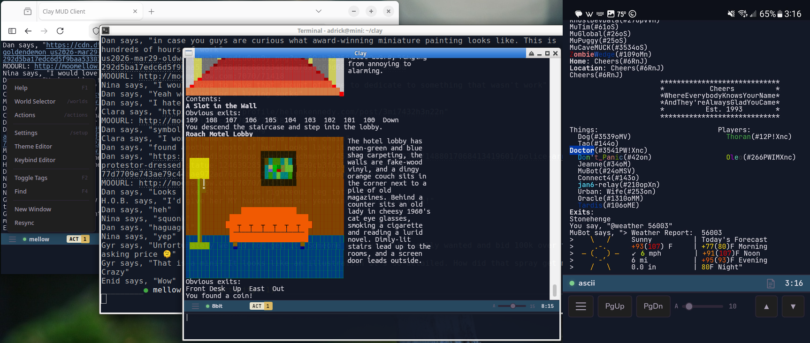

<h1 align="center">
  
   
  Clay
</h1>

  
  

  <a href="#about">About</a> •
  <a href="#key-features">Key Features</a> •
  <a href="#download">Download</a> •
  <a href="#how-to-use">How To Use</a> •
  <a href="#documentation">Documentation</a> •
  <a href="#license">License</a>

  
   
  <em>Clay in a web browser, a terminal, its desktop app and the Android app</em>

## About

Clay is a multi-world MUD client for UNIX, Windows, MacOS, and Android featuring a terminal, GUI
and web interface. It has standard mud client features including TinyFugue's commands support for
compatibility. For easy setup, configuration and triggers it has simple dialog windows or
/commands.

What sets Clay apart is it supports session sharing so your connections and history can follow
you between devices. You may need to open a port in your firewall if your second device is
on the other side of a firewall or just already setup ssh port.

## Key Features

* Windows, macOS, Linux and Android in a terminal or GUI.
* Multiple world support with different auto login types
* 256-color and true-color ANSI
* TLS, GMCP, MSDP, MSSP, MCCP, MSP and MCP
* Triggers, gags and highlights, with a point-and-click editor
* Drop in TinyFugue compatiblity
* Unlimited scrollback, find, and a searchable offline archive
* Status panel from GMCP/MSDP vitals
* Spell check, tab completion, command history
* One session from several devices at once
* Upgrades without disconnecting
* Text-to-speech, sound and ANSI music

  
And more

More-mode paging, timers, hooks, macros, grep windows, logging, timestamps, clickable links,
multi-line input, Emacs-style editing keys, history search, character encodings, themes,
fonts, custom key bindings, per-world notes, dictionary and translation lookups, an Android
app that runs Clay on its own, secure remote access, settings import, crash recovery,
headless and multi-user servers, self-update.

## Download

Get the latest version from the [releases page](https://github.com/c-hudson/clay/releases/latest):

- **Windows:** [clay-windows-x86_64.exe](https://github.com/c-hudson/clay/releases/latest/download/clay-windows-x86_64.exe)
- **macOS** (Intel and Apple Silicon): [clay-macos-universal](https://github.com/c-hudson/clay/releases/latest/download/clay-macos-universal)
- **Linux:** [clay-linux-x86_64-gui](https://github.com/c-hudson/clay/releases/latest/download/clay-linux-x86_64-gui)
  with the desktop app, or [clay-linux-x86_64-musl](https://github.com/c-hudson/clay/releases/latest/download/clay-linux-x86_64-musl)
  for the terminal only (any distro)
- **Android:** [clay-android.apk](https://github.com/c-hudson/clay/releases/latest/download/clay-android.apk)
- **Termux:** [clay-termux-aarch64-nogui](https://github.com/c-hudson/clay/releases/latest/download/clay-termux-aarch64-nogui),
  [clay-termux-aarch64](https://github.com/c-hudson/clay/releases/latest/download/clay-termux-aarch64)
  for Termux:X11, or [clay-termux-armv7-32bit-nogui](https://github.com/c-hudson/clay/releases/latest/download/clay-termux-armv7-32bit-nogui)
  for 32-bit phones

On Linux and macOS, make the file executable (`chmod +x`) before running it.

## How To Use

1. Download Clay and run it.
1. Open the **World Selector** from the ☰ menu (in a terminal, type `/world`) and click
   **Add**.
1. Give the world a **Name** and enter the **Hostname** and **Port** of your game ( e.g. `teenymush.dynu.net` and `4096`).
1. Click **Connect**.

Press F1 for help at any time. To switch worlds, click the world name in the status bar, or
press Alt+←/→ in a terminal. To use the same session from another devices, see
[Remote access](docs/markdown/11-web-interface.md#reaching-clay-from-outside-your-network).

## Compiling

Clay is written in Rust. To build it yourself, see
[Installation](docs/markdown/02-installation.md).

## Documentation

Clay has built-in help (F1, or `/help <topic>`) and a manual:
[Quick start](docs/markdown/03-quickstart.md) ·
[Commands](docs/markdown/05-commands.md) ·
[Triggers](docs/markdown/09-actions.md) ·
[Keyboard shortcuts](docs/markdown/07-keyboard-shortcuts.md) ·
[Switching from TinyFugue](docs/markdown/22-switching-from-tinyfugue.md) ·
[TinyFugue commands](docs/markdown/06-tf-commands.md) ·
[Slack and Discord](docs/markdown/21-chat-worlds.md) ·
[Remote access](docs/markdown/11-web-interface.md#reaching-clay-from-outside-your-network) ·
[Troubleshooting](docs/markdown/20-troubleshooting.md) ·
[all chapters](docs/markdown)

## Support

Questions, ideas and bug reports are welcome as
[GitHub issues](https://github.com/c-hudson/clay/issues).

## License

MIT
