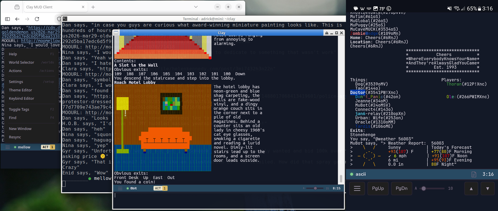

<div align="center">


# Clay MUD Client
</div>

This is a Mud Client designed those on the go but without any compromises for those who are happy
where they are. Supports all of the standard features, TinyFugue compatiblity, spell checking,
ANSI true color support, multi-world support, and connection sharing between interfaces.


*A single Clay instance viewed simultaneously from a remote terminal, a Firefox web client, and a native WebView GUI.*

## Features

- Multi-world MUD connections over SSL/TLS
- Full ANSI color (256/true-color) + telnet suite (SGA, TTYPE, EOR, NAWS, MCCP2, GMCP, MSDP)
- Auto-login, unlimited scrollback with more-mode pagination, command history
- Spell check, tab completion, output search/filter, Emacs-style kill ring
- Per-world file logging
- View one instance from console, GUI, web browser, remote console, and Android
- Android: remote client or full standalone on-device server, zero config
- Hot reload (`/reload`) without dropping connections; automatic crash recovery
- Stealth web path, IP allow-list, auth-key knock, TLS pinning (TOFU), ban list
- `/import` syncs worlds, actions, theme, and keybindings from another instance
- TinyFugue command layer (`/def /set /if /while /for /load`, `#` prefix)
- Pattern-matching actions/triggers (regex/wildcard) with startup automation
- Configurable color themes and keybindings, with browser-based live editors
- Adjustable fonts and hanging-indent wrap spacing
- Mouse support console support
- GMCP/MSDP structured data, including server-driven media (Client.Media)
- BBS-style ANSI music playback
- Dictionary, Urban Dictionary, translation, and URL-shortening lookups
- Text-to-speech via local engine or Microsoft Edge neural TTS
- Per-world notes editor in the console
- Searchable Long-term SQLite scrollback archive
- Self-update from GitHub releases
- Grep-mode output search (live and SQL archvie)
- Headless daemon and multiuser server modes

## Installation

Download pre-built binaries from the [Releases](https://github.com/c-hudson/clay/releases) page:

| Platform | Binary | Notes |
|----------|--------|-------|
| Linux x86_64 (static) | `clay-linux-x86_64-musl` | Console, Web |
| Linux x86_64 | `clay-linux-x86_64-gui` | Console, GUI, Web, Audio |
| Android | `clay-android.apk` | Console (remote or standalone server) |
| Termux ARM64 (GUI) | `clay-termux-aarch64` | Console, GUI, Web |
| Termux ARM64 | `clay-termux-aarch64-nogui` | Console, Web |
| Termux ARMv7 (32-bit) | `clay-termux-armv7-32bit-nogui` | Console, Web |
| macOS (Universal) | `clay-macos-universal` | Console, GUI, Web, Audio |
| Windows x86_64 | `clay-windows-x86_64.exe` | Console, GUI, Web, Audio |

## Building from Source

### Linux

```bash
# Static binary for any Linux (console only, no GUI)
rustup target add x86_64-unknown-linux-musl
cargo build --release --target x86_64-unknown-linux-musl --no-default-features --features rustls-backend,ssh-transport

# Build with WebView GUI + audio (requires GTK/WebKit dev libraries)
sudo apt install libwebkit2gtk-4.1-dev libgtk-3-dev libasound2-dev
cargo build --release --features webview-gui
```

### macOS

```bash
# Install Rust
curl --proto '=https' --tlsv1.2 -sSf https://sh.rustup.rs | sh

# Build with WebView GUI + audio
cargo build --release --features webview-gui
```

### Windows

```bash
# Install Rust from https://rustup.rs
# Install Visual Studio Build Tools (MSVC)

# Build with WebView GUI + audio (uses WebView2)
# Static CRT linking eliminates vcruntime140.dll dependency
set RUSTFLAGS=-C target-feature=+crt-static
cargo build --release --features webview-gui
```

### Termux (Android)

```bash
# Install Rust in Termux
pkg install rust

# Build console only (no GUI on Android)
cargo build --release --no-default-features --features rustls-backend,ssh-transport
```

## Usage

| Option | Description |
|--------|-------------|
| *(none)* | Console on Linux/Termux, GUI on Windows/macOS |
| `--console[=host[:port]]` | Console mode, or attach to a remote server (port 9000) |
| `--gui[=host[:port]]` | WebView GUI, or attach to a remote server (port 9000) |
| `--ssh` | Tunnel `--console=`/`--gui=` through SSH: `[user@]host[:clayport[:sshport]]` |
| `-D` | Headless daemon server |
| `--multiuser` | Multiuser server |
| `--local-server` | Headless, loopback-only, for an embedding client (needs `CLAY_WS_PASSWORD`); `--port=<N>` overrides the port |
| `--ssh-proxy` | Headless SSH-forward proxy for an embedding client (`--target=`, `--listen-port=`) |
| `--conf=<path>` | Custom config file (default `~/.clay/settings.dat`) |
| `--grep=host[:port] <pattern>` | Search world output; `-w` world, `--regexp`, `--noesc`, `-f` follow |
| `--grep-archive <pattern>` | Search long-term archive; `-w` world, `--regexp`, `--noesc` |
| `--dump[=<dir>]` | Export scrollback archive to CSV |
| `-v`, `--version` | Show version/build info |
| `-h`, `--help` | Show help |

Most-needed:
```bash
./clay                              # console (or GUI on Windows/macOS)
./clay --gui=hostname:port          # attach a GUI to a running Clay server
./clay -D                           # headless daemon
```

Less common:
```bash
CLAY_PASSWORD=pass ./clay --grep=hostname:port -f '*combat*'   # live grep, tail -f style
./clay --ssh --console=user@host:9000:22                       # console over an SSH tunnel
./clay --conf=/path/to/config.dat                               # custom config file
```

## Commands

**General:**

| Command | Description |
|---------|-------------|
| `/help [topic]` | Show help (or topic-specific help) |
| `/version` | Show version info |
| `/quit` | Exit the client |
| `/reload` | Hot reload the binary |
| `/update [-f]` | Download and install latest release |
| `/menu` | Open menu popup |

**Worlds & Connections:**

`/world` and `/worlds` are interchangeable aliases.

| Command | Description |
|---------|-------------|
| `/worlds [name] [-e\|-l\|-b]` | Open selector; connect/switch; `-e` edit (creates if new), `-l` skip auto-login, `-b` background |
| `/addworld <name> [host port]` | Add/update a world (TF-compatible) |
| `/connections` or `/l` | List connected worlds |
| `/connect [host port [ssl]]` | Connect to a server |
| `/disconnect` or `/dc` | Disconnect current world |
| `/send [-w world] text` | Send text to a world |
| `/flush` | Clear output buffer for current world |
| `/window [world\|--grep <pat> [-w world]]` | Open a new GUI/browser window, or a grep-results window (searches scrollback + live) |

**Settings & UI:**

| Command | Description |
|---------|-------------|
| `/setup` | Open global settings |
| `/web` | Open web/WebSocket settings |
| `/import [host[:port]]` | Pull worlds, actions, theme, and keybindings from another Clay instance |
| `/actions [world]` | Open actions/triggers editor |
| `/edit [file\|-l]` | Split-screen notes editor, or `-l` for the notes list popup |
| `/font` | Font settings popup (web/GUI only) |
| `/tag` | Toggle MUD tag display with timestamps (same as F2) |
| `/say <text>` | Speak text via TTS (uses configured TTS mode) |

**Search & Archive:**

| Command | Description |
|---------|-------------|
| `/recall [options] [range] [pattern] [-D]` | Search output/input history; `-D` searches the long-term scrollback archive (requires "Archive Output" in `/setup`) — see `/help recall` for the full option list |

**Lookup & Utility:**

| Command | Description |
|---------|-------------|
| `/dict <word>` | Look up word definition (Free Dictionary API) |
| `/urban <word>` | Look up word definition (Urban Dictionary) |
| `/translate <lang> <text>` | Translate text (also `/tr`) |
| `/url <url>` | Shorten a URL (is.gd) |

Lookup commands place the result in the input buffer with the cursor at the start, so you can type a prefix (e.g. `say`) before sending.

**Remote & Admin:**

| Command | Description |
|---------|-------------|
| `/remote [--kill <id>]` | List remote clients, or disconnect one |
| `/ban` | Show banned hosts |
| `/unban <host>` | Remove a ban |
| `/notify <msg>` | Send notification to Android app |

**Debug:**

| Command | Description |
|---------|-------------|
| `/testmusic` | Play test ANSI music sequence |
| `/dump` | Dump scrollback buffers to `~/.clay/dump.log` |

## TinyFugue Commands

Clay includes a TinyFugue compatibility layer. All TF commands work with both `/` and `#` prefixes:

| Command | Description |
|---------|-------------|
| `/set name value` | Set a variable |
| `/echo message` | Display local message |
| `/def name = body` | Define a macro/trigger |
| `/if (expr) cmd` | Conditional execution |
| `/while (expr) ... /done` | While loop |
| `/for var start end ... /done` | For loop |
| `/bind key = cmd` | Bind key to command |
| `/load filename` | Load a TF script file (also imports `.tfrc` world definitions — see `/help load`) |
| `/tfhelp [topic]` | Show TF help |

## Controls

All keybindings are configurable via `~/.clay/keybindings.dat` (defaults follow TinyFugue conventions); a browser-based keybind editor is available at `/keybind-editor`.

**World Switching:**

| Key | Action |
|-----|--------|
| `Ctrl+Up/Down` | Switch between active worlds |
| `Shift+Up/Down` | Cycle through all worlds |
| `Escape w` | Switch to world with activity |

**Input Editing:**

| Key | Action |
|-----|--------|
| `Left/Right` | Move cursor one character |
| `Ctrl+B/F` | Move cursor left/right one character |
| `Escape b/f` | Move cursor one word left/right |
| `Up/Down` | Move cursor up/down (multi-line input) |
| `Ctrl+A` / `Home` | Jump to start of line |
| `Ctrl+E` / `End` | Jump to end of line |
| `Ctrl+U` | Clear line |
| `Ctrl+W` | Delete word backward |
| `Ctrl+K` | Kill to end of line |
| `Ctrl+D` | Delete character forward |
| `Ctrl+Y` | Yank (paste from kill ring) |
| `Ctrl+T` | Transpose two characters before cursor |
| `Ctrl+V` | Insert next character literally (console only) |
| `Ctrl+P/N` | Previous/next command history |
| `Ctrl+Q` | Spell suggestions |
| `Ctrl+G` | Terminal bell |
| `Tab` | Command completion (when input starts with `/`) |
| `Escape Space` | Collapse multiple spaces to one |
| `Escape -` | Jump to matching bracket `()[]{}` |
| `Escape .` / `_` | Insert last word from previous history |
| `Escape p` | Search history backward by prefix |
| `Escape n` | Search history forward by prefix |
| `Escape Backspace` | Delete word backward (punctuation-delimited) |
| `Escape c/l/u` | Capitalize / lowercase / uppercase word |
| `Escape d` | Delete word forward |
| `Alt+Up/Down` | Resize input area (1-15 lines) |

**Kill Ring:** `Ctrl+K`, `Ctrl+U`, `Ctrl+W`, `Escape d`, and `Escape Backspace` push deleted text to the kill ring. `Ctrl+Y` pastes the most recent entry.

**Output & Scrollback:**

| Key | Action |
|-----|--------|
| `PageUp/PageDown` | Scroll output history |
| `Tab` | Release one screenful (when paused) |
| `Escape j` | Jump to end, release all pending |
| `Escape J` | Selective flush: keep highlighted pending, discard rest |
| `Escape h` | Half-page scroll up or release half screenful |
| `Ctrl+L` | Redraw screen (keep only server data) |

**General:**

| Key | Action |
|-----|--------|
| `Ctrl+R` | Hot reload |
| `F1` | Help |
| `F2` | Toggle MUD tag display with timestamps |
| `F4` | Filter/search output |
| `F8` | Toggle action highlighting |
| `F5` | Search command history (web/GUI) |
| `F9` | Toggle GMCP media audio |
| `Ctrl+C` (x2) | Quit |

**Mouse (enabled by default via "Console Mouse" in `/setup`):** click popup buttons/fields/list items, scroll wheel in popups, click-drag to highlight lines.

## Android App

On first launch, the Android app (`clay-android.apk`) asks how you want to run:

- **Run on This Phone** — standalone on-device server (`--local-server`), loopback-only, random password per launch, zero config. Hot reload and the TLS proxy aren't available in this mode.
- **Connect to a remote server** — WebSocket client of a Clay instance elsewhere: enable `/web` on the server, then enter its address and WebSocket password in the app.

The mode can be changed later in the app's settings, and it works alongside the native Termux binary if you'd rather run Clay directly in Termux.

## Web Interface

Enable in `/web` settings:

1. Set `HTTP enabled` to Yes (default port: 9000)
2. Set a `WS password` (required for authentication)
3. Optionally enable `Secure` for HTTPS (auto-generates self-signed certs)

Local: `http://localhost:9000`. Remote: stealth path `http://yourhost:9000/clay/` by default — see [Security](#security).

## Actions/Triggers

Actions match incoming MUD output against patterns and run commands, configured via `/actions`:

- Pattern: regex or wildcard (empty = manual-only)
- Command(s) to run on match, semicolon-separated
- `$1`-`$9` for captured groups, `$0` for full match
- `/gag` in a command hides the matched line, `/highlight` colors it
- Type `/actionname` to invoke manually; enable "Startup" to run on start/reload/crash-recovery

Example: pattern `* tells you: *` with command `/echo Got tell from $1`

## Themes

- Theme file: `~/.clay/theme.dat` (INI, `[theme:name]` sections)
- Browser-based theme editor for live color preview
- Select in `/setup` (GUI Theme setting)
- Console uses a separate dark/light toggle

## Text-to-Speech

Configure TTS mode in `/setup`:

- **Off** (default), **Local** (`espeak`/`say`/PowerShell), or **Edge** (Microsoft neural TTS, needs internet)
- `/say <text>` speaks immediately regardless of TTS mode
- Per-world speaker whitelist controls which names trigger automatic TTS
- Web/Android use the browser's built-in Web Speech API

## Keybindings

Configurable via `~/.clay/keybindings.dat` (INI); only non-default bindings need to be saved.

```ini
[bindings]
Up = world_next
Down = world_prev
Ctrl-Up = UNBOUND
```

`UNBOUND` removes a default binding. Browser-based editor at `/keybind-editor` when the HTTP server is enabled.

## Configuration

Settings live in `~/.clay/settings.dat` (`~/clay/settings.dat` on Windows); legacy `~/.clay.dat`/`~/.clay.key.dat`/`~/clay.theme.dat` files migrate automatically on first run. Per-world settings include:

- Hostname, port, SSL toggle
- Username/password for auto-login
- Character encoding (UTF-8, Latin1, FANSI)
- Auto-login type (Connect, Prompt, MOO_prompt)
- Keepalive type (NOP, Custom, Generic)
- Log file path
- TTS mode (Off, Local, Edge) and speaker whitelist

## License

MIT
